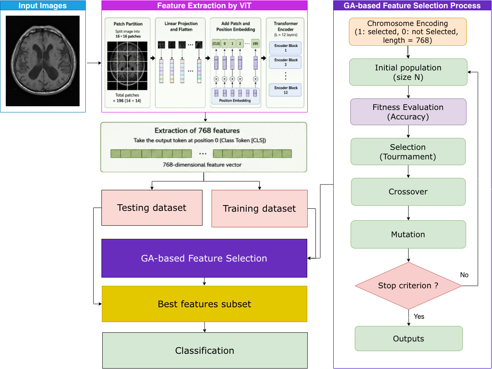
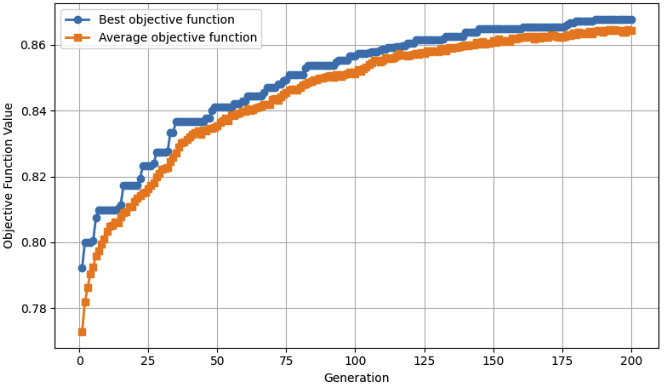
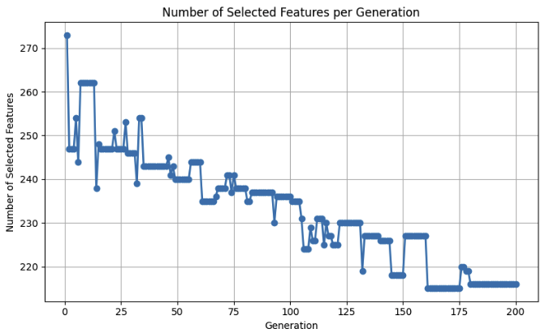

# ViT-GA2026
Medical Image Classification Using Genetic Algorithm and Vision Transformer Features

[](https://www.python.org/)
[](https://pytorch.org/)
[](https://opensource.org/licenses/MIT)

This repository provides a hybrid machine learning framework designed for medical image classification. The pipeline leverages a pre-trained **Vision Transformer (ViT-Base)** to extract high-dimensional deep features, followed by a multi-core **Parallel Genetic Algorithm (GA)** to perform optimal feature subset selection. The selected feature subset is evaluated using a **Gaussian Naive Bayes** classifier.

| The proposed model
| :---: 
| 

---

## 📌 Key Features

- **ViT Feature Extraction**: Extracts a 768-dimensional feature vector per image scan using `vit_base_patch16_224`.
- **Parallelized GA Selection**: Accelerates feature subset search using multi-core parallel processing via `joblib.Parallel`.
- **Fitness Caching**: Employs a cache mechanism to prevent re-evaluating duplicate chromosomes across generations.
- **Flexible Evaluation Strategies**:
  1. Stratified $K$-Fold Cross-Validation ($K=5$).
  2. Fast evaluation via fixed Train/Validation split.

---
## 📁 Repository Structure

```text
├── features_MRIbrain.npz         # ViT feature extraction
├── ViT-GA2026.ipynb              # Jupyter Notebook
├── Results                        # Output plots
├── requirements.txt              # Required dependencies
└── README.md                     # Documentation
```

---

## ⚙️ Installation & Setup

### 1. Prerequisites
- Python $\ge 3.10$
- CUDA-enabled GPU (recommended for fast feature extraction)

### 2. Environment Setup
Clone the repository and install the required dependencies:

```bash
git clone [https://github.com/your-username/vit-ga2026.git](https://github.com/your-username/vit-ga2026.git)
cd vit-ga-mri-classification
pip install -r requirements.txt
```

### 3. Dataset Structure
Organize your Brain MRI dataset inside the `Kaggle/DataMRI` directory as follows:
This dataset consists of 7023 images divided into four classes. The four classes in the dataset are brain pituitary, notumor, meningioma, and glioma. The dataset is publicly available at https://www.kaggle.com/datasets/masoudnickparvar/brain-tumor-mri-dataset.
```text
DataMRI/
├── Training/
│   ├── Glioma/
│   ├── Meningioma/
│   ├── NoTumor/
│   └── Pituitary/
└── Testing/
    ├── Glioma/
    └── ...
```
---
##  Usage Guide

This project supports two operational workflows: extracting features directly from raw image files or loading pre-extracted feature caches for rapid genetic algorithm experimentation.

###  Case 1: End-to-End Extraction & GA Selection
Extract 768-dimensional deep feature representations from raw MRI images using pre-trained Vision Transformer (`vit_base_patch16_224`) and optimize feature subsets via parallel Genetic Algorithm.

1. **Run Cell 1 (Feature Extraction)**:
   - Traverses `Training` and `Testing` directories.
   - Converts images to tensors and extracts ViT feature embeddings.
   - Automatically saves features to `features_MRIbrain.npz` for caching.
```python
import os
import numpy as np
from PIL import Image
from tqdm import tqdm
import time
import torch
import torch.nn as nn
import torchvision.transforms as transforms
from torchvision import models
from sklearn.naive_bayes import GaussianNB
from sklearn.metrics import accuracy_score
import timm
st = time.time()
# --------- Step 1: Setup paths ---------
BASE_DIR = "datamri"
train_dir = os.path.join(BASE_DIR, "Training")
test_dir  = os.path.join(BASE_DIR, "Testing")
print("Train path:", train_dir)
print("Test path:", test_dir)
# Get class names from directory
categories = sorted(os.listdir(train_dir))
print("Categories:", categories)
# Get image paths and labels (train)
train_paths, y_train = [], []
for idx, category in enumerate(categories):
    cat_path = os.path.join(train_dir, category)
    for filename in os.listdir(cat_path):
        if filename.lower().endswith(('.jpg', '.png', '.jpeg')):
            train_paths.append(os.path.join(cat_path, filename))
            y_train.append(idx)
# Get image paths and labels (test)
test_paths, y_test = [], []
for idx, category in enumerate(categories):
    cat_path = os.path.join(test_dir, category)
    for filename in os.listdir(cat_path):
        if filename.lower().endswith(('.jpg', '.png', '.jpeg')):
            test_paths.append(os.path.join(cat_path, filename))
            y_test.append(idx)
print(f"Train images: {len(train_paths)}, Test images: {len(test_paths)}")
# --------- Step 2: Load ViT ---------
device = torch.device("cuda" if torch.cuda.is_available() else "cpu")
print(f"Using device: {device}")
## ViT
vit = timm.create_model(
    "vit_base_patch16_224",
    pretrained=True,
    num_classes=0 )
vit = vit.to(device)
if torch.cuda.device_count() > 1:
    vit = nn.DataParallel(vit)
vit.eval()
# --------- Step 3: Transform ---------
transform = transforms.Compose([
    transforms.Resize((224, 224)),
    transforms.ToTensor(),
    transforms.Normalize(mean=[0.485, 0.456, 0.406],
                         std =[0.229, 0.224, 0.225])])
# --------- Step 4: Feature extraction ---------
def extract_features(image_paths):
    features = []
    for path in tqdm(image_paths, desc="Extracting ViT features"):
        try:
            img = Image.open(path).convert("RGB")
            img_tensor = transform(img).unsqueeze(0).to(device)
            with torch.no_grad():
                feat = vit(img_tensor)
                feat = feat.squeeze().cpu().numpy()
            features.append(feat)
        except Exception as e:
            print(f"Error processing {path}: {e}")
    return np.array(features)
features_train = extract_features(train_paths)
features_test  = extract_features(test_paths)
end = time.time()
print(features_train.shape)
print(features_test.shape)
print("Total Time:", end - st)
np.savez('ViT_features_MRIbrain.npz',
         features_train=features_train,
         features_test=features_test,
         y_train=np.array(y_train),
         y_test=np.array(y_test))
print("Save file ViT_features_MRIbrain.npz")
```

2. **Run Cell 3: GA (Parallel) with K-Fold Cross-Validation**:
   - Selects the optimal subset of extracted features using parallel fitness evaluations with K-Fold Cross-Validation.
   - Fits a Gaussian Naive Bayes classifier on the selected training features.
```python
import time
import random
import numpy as np
import matplotlib.pyplot as plt
from sklearn.naive_bayes import GaussianNB
from sklearn.model_selection import StratifiedKFold, cross_val_score
from sklearn.metrics import accuracy_score
from joblib import Parallel, delayed
st = time.time()
# --------- Step 4: Optimized Genetic Algorithm (Parallel) ---------
def genetic_algorithm(X,y,pop_size=100,generations=1000, 
    mutation_rate=0.01, n_jobs=-1,random_state=42):
    np.random.seed(random_state)
    random.seed(random_state)
    n_samples, n_features = X.shape
    # Initialize random boolean population matrix (pop_size, n_features)
    population = np.random.rand(pop_size, n_features) < 0.5
    best_history = []
    avg_history = []
    feature_count_history = []
    # Local fitness function for parallel dispatch
    def evaluate_individual(individual):
        if not np.any(individual):
            return 0.0
        X_subset = X[:, individual]
        clf = GaussianNB()
        cv = StratifiedKFold(n_splits=3, shuffle=True, random_state=42)
        # Fast cross-validation
        scores = cross_val_score(clf, X_subset, y, cv=cv, scoring='accuracy', n_jobs=1)
        return float(scores.mean())
    best_individual_overall = None
    best_fitness_overall = -1.0
    # Cache to avoid re-evaluating duplicate individuals
    fitness_cache = {}
    # Parallel runner instance (reuses process pool across iterations)
    with Parallel(n_jobs=n_jobs, backend='loky') as parallel:
        for gen in range(generations):
            # Determine which individuals need evaluation vs cache lookup
            eval_indices = []
            tasks = []
            scores = np.zeros(pop_size, dtype=float)
            for idx, ind in enumerate(population):
                key = ind.tobytes()
                if key in fitness_cache:
                    scores[idx] = fitness_cache[key]
                else:
                    eval_indices.append(idx)
                    tasks.append(delayed(evaluate_individual)(ind))
            # Compute only unseen individuals in parallel
            if tasks:
                computed_scores = parallel(tasks)
                for idx, score in zip(eval_indices, computed_scores):
                    key = population[idx].tobytes()
                    fitness_cache[key] = score
                    scores[idx] = score
            # Best and average scores for current generation
            best_idx = np.argmax(scores)
            best_ind = population[best_idx].copy()
            best_score = scores[best_idx]
            avg_score = np.mean(scores)
            best_history.append(best_score)
            avg_history.append(avg_score)
            feature_count_history.append(np.sum(best_ind))
            # Update overall best
            if best_score > best_fitness_overall:
                best_fitness_overall = best_score
                best_individual_overall = best_ind.copy()
            print(
                f"Generation {gen+1:03d}/{generations} | "
                f"Best CV: {best_score:.4f} | "
                f"Avg CV: {avg_score:.4f} | "
                f"Features: {np.sum(best_ind)}/{n_features}")
            # --- Selection (Top 50%) ---
            sorted_indices = np.argsort(scores)[::-1]
            survivors = population[sorted_indices[: pop_size // 2]]
            # --- Crossover & Mutation (Vectorized) ---
            new_population = list(survivors)
            while len(new_population) < pop_size:
                # Randomly pick two parents
                p1_idx, p2_idx = np.random.choice(len(survivors), size=2, replace=False)
                p1, p2 = survivors[p1_idx], survivors[p2_idx]
                # Single-point Crossover
                cp = np.random.randint(1, n_features)
                child = np.concatenate([p1[:cp], p2[cp:]])
                # Vectorized Mutation
                mutation_mask = np.random.rand(n_features) < mutation_rate
                child = np.logical_xor(child, mutation_mask)
                new_population.append(child)
            population = np.array(new_population, dtype=bool)
    return best_individual_overall, best_fitness_overall, best_history, avg_history, feature_count_history
# --------- Step 5: Running GA and Final Classifier ---------
# (Ensure features_train, y_train, features_test, y_test are defined prior to running)
if __name__ == '__main__':
    # Sample Mock Data (Replace with your actual features/labels)
    print("Running Parallel GA...")
    best_individual, best_fitness, best_history, avg_history, feature_count_history = genetic_algorithm(
        features_train, y_train, pop_size=100, generations=1000, mutation_rate=0.01, n_jobs=-1)
    # Train final model on selected features
    clf = GaussianNB()
    clf.fit(features_train[:, best_individual], y_train)
    y_pred = clf.predict(features_test[:, best_individual])
    test_acc = accuracy_score(y_test, y_pred)
    print(f"\n Best CV Accuracy from GA: {best_fitness:.4f}")
    print(f" Test Accuracy: {test_acc:.4f}")
    print(f" Number of selected features: {np.sum(best_individual)} / {features_train.shape[1]}")
    end = time.time()
    print(f"Total Time: {end - st:.2f} seconds")
    # --------- Step 6: Plot GA Convergence ---------
    generations_range = range(1, len(best_history) + 1)
    plt.figure(figsize=(8, 5))
    plt.plot(generations_range, best_history, marker='o', markersize=3, linewidth=2, label='Best Fitness')
    plt.plot(generations_range, avg_history, marker='s', markersize=3, linewidth=2, label='Average Fitness')
    plt.title("GA Convergence Curve")
    plt.xlabel("Generation")
    plt.ylabel("Objective Value (Accuracy)")
    plt.legend()
    plt.grid(True)
    plt.tight_layout()
    plt.savefig("GA_convergence_curve_MRI.png", dpi=300, bbox_inches='tight')
    plt.show()
    # --------- Step 7: Plot Selected Features ---------
    plt.figure(figsize=(8, 5))
    plt.plot(generations_range, feature_count_history, marker='o', markersize=3, linewidth=2, color='green')
    plt.title("Selected Features per Generation")
    plt.xlabel("Generation")
    plt.ylabel("Number of Features Selected")
    plt.grid(True)
    plt.tight_layout()
    plt.savefig("GA_selected_features_MRI.png", dpi=300, bbox_inches='tight')
    plt.show()
```
3. **Run Cell 4: GA (Parallel) without K-Fold Cross-Validation**:
   - Selects the optimal subset of extracted features using parallel fitness evaluations without K-Fold Cross-Validation.
   - Fits a Gaussian Naive Bayes classifier on the selected training features.
```python
import time
import random
import numpy as np
import matplotlib.pyplot as plt
from sklearn.naive_bayes import GaussianNB
from sklearn.model_selection import train_test_split
from sklearn.metrics import accuracy_score
from joblib import Parallel, delayed
st = time.time()
# --------- Step 4: Genetic Algorithm (Parallel & Non-K-Fold) ---------
def genetic_algorithm(X, y, pop_size=100, generations=1000, mutation_rate=0.01, val_size=0.2,n_jobs=-1,random_state=42):
    np.random.seed(random_state)
    random.seed(random_state)
    # Split training set into Train/Validation once for fast GA evaluation
    X_tr, X_val, y_tr, y_val = train_test_split(
        X, y, test_size=val_size, stratify=y, random_state=random_state)
    n_features = X.shape[1]
    # Initialize random population (Boolean)
    population = np.random.rand(pop_size, n_features) < 0.5
    best_history = []
    avg_history = []
    feature_count_history = []
    # Function to calculate fitness on the validation set
    def evaluate_individual(individual):
        if not np.any(individual):
            return 0.0
        # Train on small Train set, evaluate on Validation set
        clf = GaussianNB()
        clf.fit(X_tr[:, individual], y_tr)
        preds = clf.predict(X_val[:, individual])
        return float(accuracy_score(y_val, preds))
    best_individual_overall = None
    best_fitness_overall = -1.0
    # Cache memory to avoid recalculating duplicate individuals
    fitness_cache = {}
    # Parallel processing manager
    with Parallel(n_jobs=n_jobs, backend='loky') as parallel:
        for gen in range(generations):
            # Check which individuals are already in the cache
            eval_indices = []
            tasks = []
            scores = np.zeros(pop_size, dtype=float)
            for idx, ind in enumerate(population):
                key = ind.tobytes()
                if key in fitness_cache:
                    scores[idx] = fitness_cache[key]
                else:
                    eval_indices.append(idx)
                    tasks.append(delayed(evaluate_individual)(ind))
            # Compute fitness in parallel for new individuals
            if tasks:
                computed_scores = parallel(tasks)
                for idx, score in zip(eval_indices, computed_scores):
                    key = population[idx].tobytes()
                    fitness_cache[key] = score
                    scores[idx] = score
            # Store best & average scores
            best_idx = np.argmax(scores)
            best_ind = population[best_idx].copy()
            best_score = scores[best_idx]
            avg_score = np.mean(scores)
            best_history.append(best_score)
            avg_history.append(avg_score)
            feature_count_history.append(np.sum(best_ind))
            # Update overall best individual
            if best_score > best_fitness_overall:
                best_fitness_overall = best_score
                best_individual_overall = best_ind.copy()
            print(
                f"Generation {gen+1:03d}/{generations} | "
                f"Val Acc: {best_score:.4f} | "
                f"Avg Acc: {avg_score:.4f} | "
                f"Features: {np.sum(best_ind)}/{n_features}")
            # --- Select Top 50% best individuals ---
            sorted_indices = np.argsort(scores)[::-1]
            survivors = population[sorted_indices[: pop_size // 2]]
            # --- Crossover & Mutation (Vectorized) ---
            new_population = list(survivors)
            while len(new_population) < pop_size:
                p1_idx, p2_idx = np.random.choice(len(survivors), size=2, replace=False)
                p1, p2 = survivors[p1_idx], survivors[p2_idx]
                # Single-point crossover
                cp = np.random.randint(1, n_features)
                child = np.concatenate([p1[:cp], p2[cp:]])
                # Mutation
                mutation_mask = np.random.rand(n_features) < mutation_rate
                child = np.logical_xor(child, mutation_mask)
                new_population.append(child)
            population = np.array(new_population, dtype=bool)
    return best_individual_overall, best_fitness_overall, best_history, avg_history, feature_count_history
# --------- Step 5: Run GA and Test on Independent Test Set ---------
if __name__ == '__main__':
    best_individual, best_fitness, best_history, avg_history, feature_count_history = genetic_algorithm(
        features_train, y_train, pop_size=100, generations=1000, mutation_rate=0.01, val_size=0.2, n_jobs=-1)
    # Final evaluation on the independent test set
    clf = GaussianNB()
    clf.fit(features_train[:, best_individual], y_train)
    y_pred = clf.predict(features_test[:, best_individual])
    test_acc = accuracy_score(y_test, y_pred)
    print(f"\n Best Validation Accuracy from GA: {best_fitness:.4f}")
    print(f" Test Accuracy: {test_acc:.4f}")
    print(f" Number of selected features: {np.sum(best_individual)} / {features_train.shape[1]}")
    end = time.time()
    print(f"Total Time: {end - st:.2f} seconds")
```
---

### 📌 Case 2: Fast Experimentation via Feature Cache
Skip the time-consuming ViT extraction phase by re-loading pre-calculated feature tensors directly into memory.

1. **Run Cell 2 (Cache Loading)**:
   - Detects the existing `features_MRIbrain.npz` cache file.
   - Loads `features_train`, `features_test`, `y_train`, and `y_test` arrays in seconds.
```python
import numpy as np
# Load feature file
data = np.load("/kaggle/input/datasets/ViT_features_MRIbrain.npz")
# Retrieve data
features_train = data["features_train"]
features_test = data["features_test"]
y_train = data["y_train"]
y_test = data["y_test"]
# Check
print("Train features:", features_train.shape)
print("Test features :", features_test.shape)
print("Train labels  :", y_train.shape)
print("Test labels   :", y_test.shape)
```
2. **Run Cell 3: GA (Parallel) with K-Fold Cross-Validation**:
   - Selects the optimal subset of extracted features using parallel fitness evaluations with K-Fold Cross-Validation.
   - Fits a Gaussian Naive Bayes classifier on the selected training features.
   - Run the same code as in Case 1.
3. **Run Cell 4: GA (Parallel) without K-Fold Cross-Validation**:
   - Selects the optimal subset of extracted features using parallel fitness evaluations without K-Fold Cross-Validation.
   - Fits a Gaussian Naive Bayes classifier on the selected training features.
   - Run the same code as in Case 1.
---
### ⚙️ Evaluation Strategies: K-Fold CV vs. Train/Val Split

You can configure the evaluation strategy inside **Cell 2** by setting the `USE_KFOLD` parameter:

* **Single Split Mode (`USE_KFOLD = False`)**:
  - Splits training data into an internal 80/20 Train/Validation set once.
  - Recommended for fast GA optimization across high generation counts ($1000+$ generations).

* **Stratified K-Fold CV (`USE_KFOLD = True`)**:
  - Evaluates each individual's fitness using Stratified $K$-Fold Cross-Validation (default: $K=5$).
  - Recommended for robust validation preventing sample split bias.

```python
# Configure in Cell 2:
USE_KFOLD = 5  # Set to True to enable 5-Fold Stratified CV
```
---

Continue with the other machine learning models.
**AdaBoost**
```python
import numpy as np
import matplotlib.pyplot as plt
import seaborn as sns
import time

from sklearn.ensemble import AdaBoostClassifier
from sklearn.tree import DecisionTreeClassifier
from sklearn.metrics import accuracy_score, confusion_matrix, classification_report
st = time.time()
# --------- Feature selection using GA ---------
X_train_selected = features_train[:, best_individual]
X_test_selected  = features_test[:, best_individual]
# --------- Train AdaBoost ---------
# Base learner typically uses a Decision Tree stump (max_depth=1)
base_est = DecisionTreeClassifier(max_depth=1, random_state=42)
clf = AdaBoostClassifier(
    estimator=base_est,     # Use base_estimator= for older sklearn versions
    n_estimators=300,
    learning_rate=0.5,
    algorithm="SAMME.R",    # Change to "SAMME" if version error occurs
    random_state=42)
clf.fit(X_train_selected, y_train)
# --------- Prediction ---------
y_pred = clf.predict(X_test_selected)
test_accuracy = accuracy_score(y_test, y_pred)
print(f"Test accuracy using selected features (AdaBoost): {test_accuracy:.4f}")
# --------- Plot error vs. number of estimators (similar to 'epochs') ---------
train_err = []
test_err = []
for yhat_tr in clf.staged_predict(X_train_selected):
    train_err.append(1 - accuracy_score(y_train, yhat_tr))
for yhat_te in clf.staged_predict(X_test_selected):
    test_err.append(1 - accuracy_score(y_test, yhat_te))
x_axis = range(1, len(train_err) + 1)
plt.figure(figsize=(7, 5))
plt.plot(x_axis, train_err, label="Train error")
plt.plot(x_axis, test_err, label="Test error")
plt.xlabel("Number of Estimators")
plt.ylabel("Error (1 - accuracy)")
plt.title("AdaBoost Error over Number of Estimators")
plt.legend()
plt.grid(True)
plt.savefig("AdaBoost_error.png")
plt.show()
# --------- Confusion Matrix ---------
cm = confusion_matrix(y_test, y_pred)
classes = np.unique(y_test)
plt.figure(figsize=(6, 5))
sns.heatmap(cm, annot=True, fmt="d", cmap="Blues",
            xticklabels=classes, yticklabels=classes)
plt.xlabel("Predicted")
plt.ylabel("True")
plt.title("Confusion Matrix (AdaBoost with GA features)")
plt.savefig("CM_AdaBoost.png")
plt.show()
# --------- Classification Report ---------
print("\nClassification Report:")
print(classification_report(y_test, y_pred))
end = time.time()
print("Total Time:", end - st)
```
**Decision Tree**
```python
import time
import matplotlib.pyplot as plt
import numpy as np
import seaborn as sns
from sklearn.metrics import accuracy_score, classification_report, confusion_matrix
from sklearn.tree import DecisionTreeClassifier
st = time.time()
# Feature selection via GA
X_train_selected = features_train[:, best_individual]
X_test_selected = features_test[:, best_individual]
# Train Decision Tree
clf = DecisionTreeClassifier(
    criterion="gini",
    max_depth=None,
    min_samples_split=2,
    min_samples_leaf=1,
    random_state=42,)
clf.fit(X_train_selected, y_train)
# Evaluate
y_pred = clf.predict(X_test_selected)
print(f"Test accuracy: {accuracy_score(y_test, y_pred):.4f}\n")
print("Classification Report:\n", classification_report(y_test, y_pred))
# Plot Confusion Matrix
classes = np.unique(y_test)
plt.figure(figsize=(6, 5))
sns.heatmap(
    confusion_matrix(y_test, y_pred),
    annot=True,
    fmt="d",
    cmap="Blues",
    xticklabels=classes,
    yticklabels=classes,)
plt.xlabel("Predicted")
plt.ylabel("True")
plt.title("Confusion Matrix (Decision Tree with GA features)")
plt.savefig("CM_DT.png")
plt.show()
print("Total Time:", time.time() - st)
```
**Gaussian Naive Bayes**

```python
import time
import matplotlib.pyplot as plt
import numpy as np
import seaborn as sns
from sklearn.metrics import accuracy_score, classification_report, confusion_matrix
from sklearn.naive_bayes import GaussianNB
st = time.time()
# Feature selection via GA
X_train_selected = features_train[:, best_individual]
X_test_selected = features_test[:, best_individual]
# Train Gaussian Naive Bayes
clf = GaussianNB()
clf.fit(X_train_selected, y_train)
# Evaluate
y_pred = clf.predict(X_test_selected)
print(f"Test accuracy: {accuracy_score(y_test, y_pred):.4f}\n")
print("Classification Report:\n", classification_report(y_test, y_pred))
# Plot Confusion Matrix
classes = np.unique(y_test)
plt.figure(figsize=(6, 5))
sns.heatmap(
    confusion_matrix(y_test, y_pred),
    annot=True,
    fmt="d",
    cmap="Blues",
    xticklabels=classes,
    yticklabels=classes,)
plt.xlabel("Predicted")
plt.ylabel("True")
plt.title("Confusion Matrix (GaussianNB with GA features)")
plt.savefig("CM_GNB.png")
plt.show()
print("Total Time:", time.time() - st)
```
---
## Experimental Results

Experimental performance evaluation on the Brain MRI dataset: 

### 1. Performance Comparison

*Performance (mean ± std) and total time comparison of all methods in Application 1 using 5-fold stratified cross-validation.*

| Method | ACC | Precision | Recall | F1-score | Time (s) | Rank |
| :--- | ---: | ---: | ---: | ---: | ---: | ---: |
| **Proposed** | **0.989 ± 0.005** | **0.989 ± 0.006** | **0.989 ± 0.006** | **0.989 ± 0.006** | **283** | **1** |
| **Traditional Machine Learning** | &nbsp; | &nbsp; | &nbsp; | &nbsp; | &nbsp; | &nbsp; |
| FG - ANN | 0.933 ± 0.006 | 0.931 ± 0.007 | 0.930 ± 0.006 | 0.930 ± 0.006 | 130 | 2 |
| FG - SVM | 0.923 ± 0.003 | 0.922 ± 0.003 | 0.920 ± 0.003 | 0.921 ± 0.003 | 128 | 3 |
| FG - Random Forest | 0.916 ± 0.009 | 0.914 ± 0.009 | 0.912 ± 0.010 | 0.912 ± 0.010 | 146 | 4 |
| FG - Naive Bayes | 0.849 ± 0.010 | 0.844 ± 0.011 | 0.843 ± 0.011 | 0.843 ± 0.011 | 120 | 7 |
| FG - AdaBoost | 0.814 ± 0.007 | 0.809 ± 0.007 | 0.809 ± 0.007 | 0.808 ± 0.007 | 305 | 9 |
| FG - Decision Tree | 0.772 ± 0.008 | 0.767 ± 0.009 | 0.764 ± 0.009 | 0.765 ± 0.009 | 127 | 12 |
| **Deep Learning** | &nbsp; | &nbsp; | &nbsp; | &nbsp; | &nbsp; | &nbsp; |
| AlexNet | 0.850 ± 0.022 | 0.850 ± 0.018 | 0.850 ± 0.018 | 0.850 ± 0.019 | 2133 | 5 |
| InceptionV3 | 0.850 ± 0.021 | 0.850 ± 0.023 | 0.850 ± 0.023 | 0.850 ± 0.021 | 2172 | 6 |
| Inception ResNet V2 | 0.815 ± 0.001 | 0.840 ± 0.003 | 0.815 ± 0.003 | 0.815 ± 0.002 | 1789 | 8 |
| ResNet50 | 0.801 ± 0.022 | 0.810 ± 0.020 | 0.810 ± 0.017 | 0.810 ± 0.021 | 1639 | 10 |
| VGG16 | 0.800 ± 0.012 | 0.800 ± 0.010 | 0.800 ± 0.013 | 0.800 ± 0.011 | 2720 | 11 |

### 2. Convergence Plots

Convergence curves and selected feature count trends are automatically generated and saved as follows:

| Convergence Curve | Selected Features per Generation |
| :---: | :---: |
|  |  |

---

## 📜 Citation

If you find this code or research useful in your work, please cite it as follows:

```bibtex
@article{ViTGA2026,
  author    = {ViTGA2026},
  title     = {Medical Image Classification Using Genetic Algorithm and Vision Transformer Features},
  journal   = {Neural Computing & Applications (Revsied)},
  year      = {2026}
}
```

---

## 📄 License

This project is licensed under the **MIT License**. See the [LICENSE](LICENSE) file for details.
